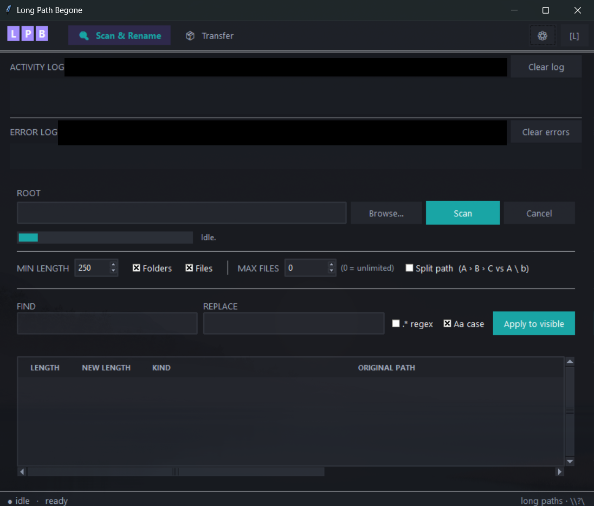

# Long Path Begone (v1.0)

> [!CAUTION]
> **DISCLAIMER:**  
> This software was generated with **Claude Code** (Anthropic), using model **Claude Opus 4.7**.  
> There is no need to credit this repository - this code was not written by myself. Fork or republish at will.   
> I only publish this because I've seen other people online looking for something similar, like Long Path Tool.   
> **The original software will not be updated and will remain at version 1.**
> If you build on it, please change the version number and describe your changes in the README.
> 
> **This is completely vibe-coded but was tested on real deeply-nested folder trees and bugs were fixed!**

A Windows desktop tool for files and folders whose paths exceed the legacy 260-character `MAX_PATH` limit.  
Scan a folder tree, rename paths inline or via find/replace, or copy/move/delete long-path items — all without touching the registry.  
Completely offline and self-contained!

**Examples:**
- Shorten `C:\Projects\ClientWork\2024\Q1\Reports\Final\Review\Archive\draft_v3_FINAL_actually-final.docx` by renaming segments with find/replace
- Delete or move files that Windows Explorer refuses to touch because their paths are too long

**Before you use it:**
- Always keep a backup before running bulk renames or moves on important data.
- The Transfer page bypasses the Recycle Bin — deleted files are gone immediately.



---

## Table of Contents

1. [What is MAX\_PATH?](#what-is-max_path)
2. [How the Software Works (Overview)](#how-the-software-works-overview)
3. [Installation](#installation)
4. [How to Use](#how-to-use)
5. [Features](#features)
6. [Project Files](#project-files)

---

## What is MAX_PATH?

**MAX_PATH** is a legacy Windows limit that restricts file paths to **260 characters**. It dates back to the DOS era and is still enforced by default on Windows 10 and 11.

- A path like `C:\Users\YourName\Documents\Work\Projects\Client\2024\Q1\Deliverables\Final\Report_draft_v3.docx` can easily exceed this limit when folders are deeply nested.
- When a path exceeds 260 characters, Windows Explorer may refuse to open, copy, rename, or delete the file — showing errors like *"File name too long"* or *"The file could not be found."*

Windows 10 v1607+ can enable long-path support system-wide via the registry (`LongPathsEnabled`), but many machines have it disabled. **Long Path Begone works regardless of that setting**, using the `\\?\` extended-length path prefix which bypasses the limit entirely (up to ~32,767 characters).

---

## How the Software Works (Overview)

The app has two pages, switched via the titlebar.

### Scan & Rename page

1. **Enter a root folder** and click **Scan**. The app walks the entire folder tree and lists every file and folder whose path meets or exceeds the minimum length you set.
2. **Edit paths** — double-click any NEW PATH cell to edit it inline, or use **Find & Replace** to update many rows at once. Literal and regex modes are supported, including `\1` / `$1` backreferences.
3. Click **Apply Renames**. The app renames one path segment at a time, parents before children, so no intermediate paths ever go missing. A fresh scan runs automatically when done.

### Transfer page

1. **Paste or browse** for a list of long-path files and folders (one per line).
2. Choose **Copy**, **Move**, or **Delete** and click Go.
3. The app processes each item, clears read-only attributes if needed, logs every result, and continues past individual failures. Delete bypasses the Recycle Bin.

---

## Installation

### Option A: Standalone EXE (no Python required)

1. Download **`LongPathBegone.exe`** from the `dist\` folder (or the [Releases](../../releases) page if available).
2. Place it anywhere and double-click to run. No setup needed.

The exe is a single file (~12 MB) with everything bundled in — no Python install, no dependencies.

### Option B: Python source (requires Python)

1. Make sure **Python 3.10 or newer** is installed ([python.org](https://www.python.org/downloads/)).
2. Run directly — no pip install required, the app uses only the standard library:

```bat
python long_path_begone.py
```

### Building the EXE yourself

Requires PyInstaller (`pip install pyinstaller`). A `LongPathBegone.spec` is included so the build is repeatable:

```bat
python -m PyInstaller LongPathBegone.spec
```

Produces `dist\LongPathBegone.exe`. To build from scratch without the spec file:

```bat
python -m PyInstaller --onefile --windowed --name LongPathBegone long_path_begone.py
```

---

## How to Use

### Scan & Rename

1. Open the app. The **Scan & Rename** page is shown by default.
2. Type or paste a folder path into the **ROOT** field, or click **Browse**.
3. Set **MIN LENGTH** to filter — only paths at or above this character count appear in the table. Default is 260.
4. Click **Scan**. A progress bar shows while the tree is walked. Click **Cancel** to stop early.
5. The results table shows each path's current length, projected new length after edits, and whether it is a file or folder.
6. **To rename one path:** double-click its NEW PATH cell, edit, press Enter.
7. **To rename many paths at once:** type a search term in **Find**, a replacement in **Replace**, and click **Apply to visible**. Tick **.\*** for regex mode, **Aa** for case-sensitive matching.
8. When ready, click **Apply Renames**. A fresh scan runs automatically when done.

### Transfer

1. Click **Transfer** in the titlebar.
2. Paste file/folder paths into the text box (one per line), or click **Browse** to pick them.
3. For Copy or Move, set the **Destination** folder.
4. Tick **Overwrite** if you want existing files at the destination to be replaced.
5. Click **Copy**, **Move**, or **Delete**. Progress and results appear in the activity log below.

---

## Features

- **Scan & Rename** — Recursively walk a folder tree and list every item with its path length in a sortable table. Edit any path inline or via find/replace (literal or regex, `\1`/`$1` backreference support). Renames are applied parents-first, segment by segment — no duplicate folders are ever created.
- **Transfer** — Copy, Move, or Delete batches of long-path items. Bypasses the Recycle Bin (deletes things Explorer refuses to touch), clears the read-only attribute, logs every operation, and continues past individual failures. Prefer Copy over Move — a copy can be verified before the source is deleted manually.
- **Scan limit** — Stop scanning after N files (0 = unlimited).
- **Progress & cancellation** — Cancel any scan or transfer mid-run.
- **Column visibility** — Toggle any column in the scan table via Settings.
- **Appearance** — Light / Dark toggle, six accent colours, UI font-size slider, typeface selector. Settings persist to `settings.json` — fully portable, no registry writes.
- **Activity log** — Save to file (appends to `activity_log.txt`) and Clear buttons.
- **Pure Python stdlib** — No pip install needed to run from source.

---

## Project Files

| File | Purpose |
|------|---------|
| `long_path_begone.py` | The entire application. Pure Python, no dependencies beyond stdlib. |
| `LongPathBegone.spec` | PyInstaller build config. Run `python -m PyInstaller LongPathBegone.spec` to produce `dist\LongPathBegone.exe`. |
| `settings.json` | Auto-created on first run. Stores your preferences (theme, fonts, column visibility). |
| `dist\LongPathBegone.exe` | Compiled standalone exe. Download or build yourself — see [Installation](#installation). |
| `README.md` | This file. |
| `SourceCode.md` | Line-by-line code walkthrough for every part of the app. |
| `ERRORS.md` | Win32 error code reference and troubleshooting guide. |
